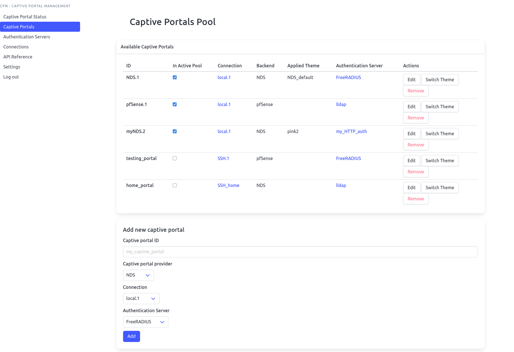

# Captive Portal Management System

- author: Bc. Ondřej Mikula
- thesis supervisor: [Ing., Jan Pluskal, Ph.D](https://www.fit.vut.cz/person/pluskal/)
- licence: [MIT](license.txt)
- year: 2024-2025

## About the Project

Captive Portal Management (CPM) system is a web application aimed at network administrators to control captive portals and authentication back-ends. It provides web interface and an API. Its main advantage aims to be automation of tasks involving either one or many captive portals, from adding and removing new users in batch, changing splash page themes to monitoring state of managed portals and accessing log files. Target audience includes both professional and hobbyist network administrators, to whom can CPM provide with a central dashboard for all of their captive portals.

Captive Portal Management System was developed as a Master's thesis at Faculty of Information Technology, Brno University of Technology ([FIT BUT](https://www.fit.vut.cz/)), Brno.

The project is built in Python using [Flask](https://palletsprojects.com/projects/flask/) web framework. Front-end is server-side rendered using [Bulma](https://bulma.io/) CSS library. Code of the application is based on 3-layer architecture and is located in the folder `CPM/`. Application's state is kept in `instance/`:

- CPM
    - modules -- code of the CPM split into logical modules,
    - static -- CSS and JS files,
    - templates -- HTML files for front-end.
- instance
    - tmp -- folder for temporary files,
    - themes -- folder to store captive portal themes,
    - config.py -- basic configuration,
    - config.ini -- stores entities that CPM works with,
    - passwd -- username and hashed user's password.



## Currently Supported Captive Portals:
- [NoDogSplash](https://github.com/nodogsplash/nodogsplash)
- [pfSense](https://docs.netgate.com/pfsense/en/latest/captiveportal/index.html)

## Currently Supported Authentication Back-Ends:
- [FreeRADIUS](https://freeradius.org)
- [LLDAP](https://github.com/lldap/lldap)
- [HTTP Basic Authentication](https://gist.github.com/dragermrb/108158f5a284b5fba806)
- local storage


## Installation

The CPM requires Python. It was developed and tested on version 3.13. Firstly, create a new virtual environment and activate it:
```
python3 -m venv .venv
source .venv/bin/activate
```

Then install all the required Python packages:
```
pip install -r requirements.txt
```

Besided Python dependencies, the project optionally requires [monolith](https://github.com/Y2Z/monolith) and [wkhtmltopdf](https://wkhtmltopdf.org/) for webpage scraping functionality.

For the next step, a bit of manual configuration file editing is needed. In `instance/config.py`, ensure that variables `CONFIG_FILE`, `PASSWD_FILE`, `THEMES_FOLDER`, and `TMP_FOLDER` all point to desired location. Conveniently, all of the items can be left in the `instance` folder and only absolute paths must be changed. It is also possible to disable web frontend or API in here.

The Bulma CSS library is already included in the repository and does not need to be installed.


### Service

To install and run the CPM as a Systemd service, execute Makefile rule `install_service`. The service is named `captive-portal-management.service`.

### Docker

To build and install the CPM as Docker image, execute Makefile rule `docker_image`. The Docker image is named `captive-portal-management:1.0`.


## Running CPM

After satisfying requirements, the application can be launched simply using Makefile rule `run`. For other options and examples, see Makefile. By default, the application listens on port 5000. Default login credentials are `admin`/`admin`. It is recommended to change those in the Settings tab as a first step. The Application has two modes of operation, so-called "single" and "pool". In single mode, the interface is designed to be convenient for users who need to administrate only one captive portal. On the other hand, "pool" mode allows users to work with many captive portals at once. The mode can be switched at any time in settings.

The API is available under `/api/` and its Swagger documentation is at `/gui/doc`.

Upon start, no captive portals, connections, nor authentication back-ends are available in CPM. You can add yours through the interface, or experiment with pre-configured ones. Simply overwrite `instance/config.ini` with `instance/example_config.ini` and restart CPM.


## Configuration Options

The CPM has two main configuration files, by default located in `instance` directory. Firstly, `config.py` specifies path to the other configuration file and other directories that the CPM needs to function properly. The `config.ini` holds all the entities (captive portals, connections and authentication servers) that are in the system and is supposed to be edited through user interface.

The following figure shows entities stored in `config.ini` and their relations:


## Extending CPM

Back-end of Captive Portal Management is designed in a modular way, to allow extendability: specifically, support for new captive portals, authentication back-ends and connections can be added. Each of them is represented by an abstract class (in `CPM/modules/` and either `portals/abstractPortal.py`, `auth_servers/_abstract.py` or `connection/connection.py`) that the new entity must extend. Implementation of its method is highly dependent on specifics of the added entity, however inspiration can be found in existing subclasses. After implementing its class, the Python file must be imported to the specific `__init__.py` and a branch of code must be added into `CPM/backend.py` analogically to existing portals or authentication backends. Finally, the entity must be inserted to the corresponding list in `instance/config.py` so that it becomes detected in the application.
